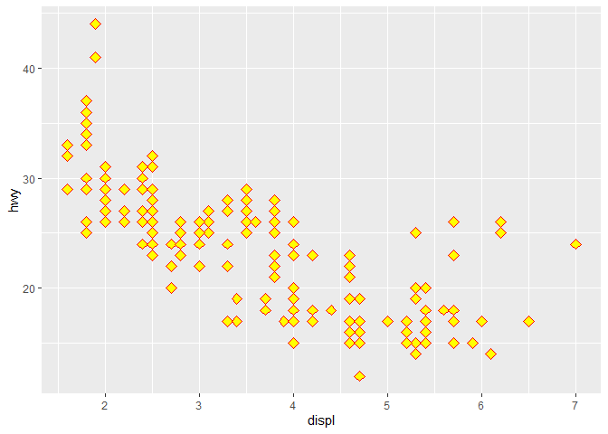

Intro GGplot
================

## Leyendo Datos

``` r
data(mpg)
# View(mpg) #leyendo datos
attach(mpg)
str(mpg)
```

    ## tibble [234 x 11] (S3: tbl_df/tbl/data.frame)
    ##  $ manufacturer: chr [1:234] "audi" "audi" "audi" "audi" ...
    ##  $ model       : chr [1:234] "a4" "a4" "a4" "a4" ...
    ##  $ displ       : num [1:234] 1.8 1.8 2 2 2.8 2.8 3.1 1.8 1.8 2 ...
    ##  $ year        : int [1:234] 1999 1999 2008 2008 1999 1999 2008 1999 1999 2008 ...
    ##  $ cyl         : int [1:234] 4 4 4 4 6 6 6 4 4 4 ...
    ##  $ trans       : chr [1:234] "auto(l5)" "manual(m5)" "manual(m6)" "auto(av)" ...
    ##  $ drv         : chr [1:234] "f" "f" "f" "f" ...
    ##  $ cty         : int [1:234] 18 21 20 21 16 18 18 18 16 20 ...
    ##  $ hwy         : int [1:234] 29 29 31 30 26 26 27 26 25 28 ...
    ##  $ fl          : chr [1:234] "p" "p" "p" "p" ...
    ##  $ class       : chr [1:234] "compact" "compact" "compact" "compact" ...

## Including Plots

``` r
p <- ggplot(data = mpg) # PASO 1
p + geom_point(aes(x=displ,y=hwy))
```

<!-- -->

``` r
# ?geom_point # Buscar Ayuda
```

> Tipos de Figuras:
> <https://www.dropbox.com/s/h18nmf5vahdidzs/figuras.Rmd?dl=0>

## Aplicando aes

``` r
    p + geom_point(aes(x=displ,y=hwy), shape=23, size=3, color="red",fill="yellow")
```

<!-- -->
